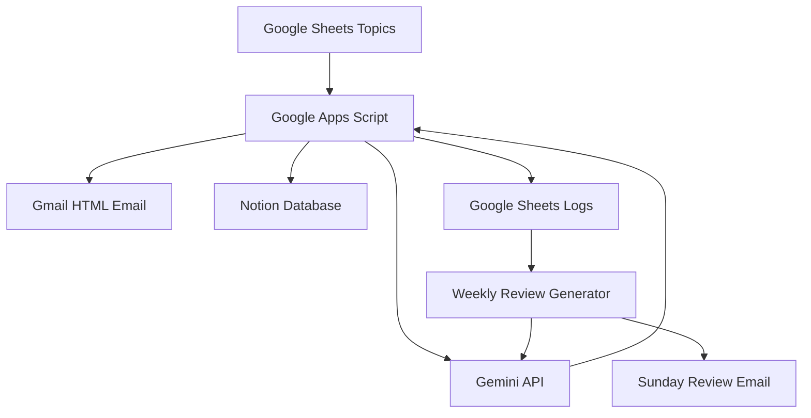

# Daily Web Engineering Fundamentals

## Overview

This project is an AI-powered daily learning system for Web engineers.

The goal is to continuously build strong engineering fundamentals while avoiding information overload from AI trend content.

Every day, the system:

* Picks one engineering topic
* Generates a short educational article using Gemini API
* Sends a readable HTML email
* Saves learning logs to Notion
* Tracks progress in Google Sheets

Additionally, every Sunday:

* Weekly review emails are generated automatically
* Mini quizzes are created
* Related concepts are reviewed together

---

# Architecture



---

# Features

## Daily Learning Delivery

Every day:

* One Web engineering topic is selected
* Gemini generates a short article
* HTML email is delivered automatically
* Learning logs are stored
* Topic status is updated automatically

Example topics:

* HTTP Cache
* Event Loop
* CORS
* JWT
* Docker Basics
* SSR vs CSR

---

## Weekly Review System

Every Sunday:

* Logs from the last 7 days are collected
* Gemini generates a review summary
* Mini tests are created
* Important concepts are connected together

This improves long-term retention.

---

## Notion Knowledge Base

Learning history is automatically saved into Notion.

Database structure:

| Property | Type   |
| -------- | ------ |
| Topic    | Title  |
| Category | Select |
| Level    | Select |
| Summary  | Text   |
| Quiz     | Text   |
| Date     | Date   |
| Status   | Select |

This creates a personal engineering knowledge database.

---

# Technologies Used

| Technology         | Purpose                |
| ------------------ | ---------------------- |
| Google Apps Script | Automation             |
| Gemini API         | Content generation     |
| Gmail              | Daily email delivery   |
| Google Sheets      | Topic & log management |
| Notion API         | Knowledge database     |
| HTML Email         | Readable newsletters   |

---

# Automation Flow

## Daily Flow

1. Read unsent topic from Google Sheets
2. Generate educational content using Gemini
3. Convert Markdown to HTML
4. Send Gmail newsletter
5. Save logs to Notion
6. Mark topic as sent

---

## Weekly Flow

1. Collect 7-day learning logs
2. Generate weekly review with Gemini
3. Create quizzes and summaries
4. Send Sunday review email

---

# Why This Project Matters

Modern engineering content is often:

* Trend-focused
* AI-overloaded
* Short-lived

This project focuses instead on:

* Fundamentals
* Continuous learning
* Practical engineering knowledge
* Long-term skill development

---

# Future Improvements

Potential future features:

* English learning mode
* Quiz answer tracking
* Difficulty adaptation
* Slack / Discord integration
* AWS-focused learning tracks
* Visual diagrams
* Personalized weak-point reviews

---

# Example Email Format

```md
# Today's Topic
HTTP Cache

## In One Sentence
A mechanism to avoid fetching the same data repeatedly.

## Why It Matters
- Faster websites
- Better UX
- Reduced server load

## Real-world Example
Cache-Control: public, max-age=31536000

## Common Mistakes
- Over-caching dynamic content
- Using no-store unnecessarily

## Today's Quiz
What is the difference between no-cache and no-store?
```

---

# Repository Structure Suggestion

```txt
project-root/
├── README.md
├── apps-script/
│   └── Code.gs
├── docs/
│   └── architecture.png
└── screenshots/
    ├── gmail-example.png
    └── notion-db.png
```
